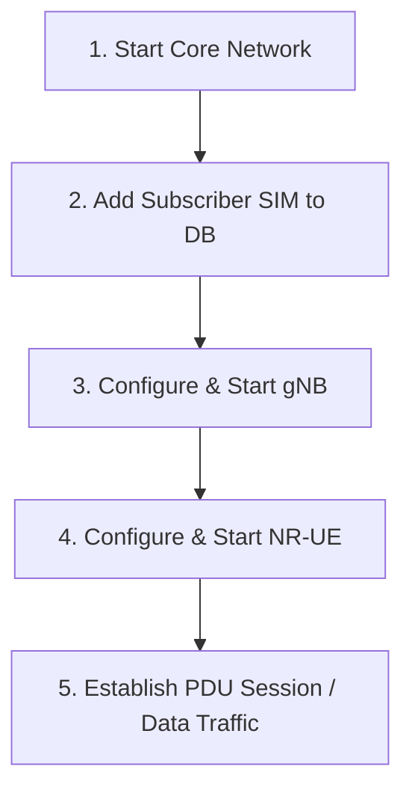

# 5G Laboratory: Open5GS Core & OpenAirInterface 5G

This repository contains a complete, containerized **5G End-to-End (E2E) Laboratory** environment. It integrates the **Open5GS** 5G Core Network (5GC) with the **OpenAirInterface (OAI)** gNodeB (gNB) and NR User Equipment (NR-UE).

The laboratory supports two operational modes:
1. **RFSimulator (rfsim)**: A software-only simulation environment. It requires **no hardware** (ideal for testing, prototyping, and debugging local protocol stacks).
2. **Physical Mode (USRP)**: Utilizes real hardware transceivers (such as Ettus USRP B210, X310, or X410) to transmit over-the-air or through RF cables.

---

## 🛠 Dependencies & Installation

To run this laboratory on your host Linux machine, you must install the following dependencies:

### 1. Docker & Docker Compose (v2)
All network components (Core Network and RAN nodes) are containerized.
* Follow the official guide to install [Docker Engine for Linux](https://docs.docker.com/engine/install/).
* Ensure your user is added to the `docker` group so you can execute commands without `sudo`:
  ```bash
  sudo usermod -aG docker $USER
  newgrp docker
  ```

### 2. `jq` (JSON Command-Line Processor)
The configuration helper scripts (`configure_gnb.sh`, `configure_ue.sh`, `manage_subscribers.sh`) use `jq` to dynamically parse and apply parameters from JSON configuration files.
* **Ubuntu/Debian**:
  ```bash
  sudo apt-get update && sudo apt-get install -y jq
  ```
* **CentOS/RHEL/Fedora**:
  ```bash
  sudo dnf install -y jq
  ```

---

## 📁 Repository Structure

```
5G_Laboratory/
├── Open5GS_CN/              # Core network bind mounts, logs, and WebUI configs
├── confs/                   # Configuration templates & component JSON parameters
│   ├── RUs/                 # Radio Unit Profiles (RFSim, USRP B210/X310/X410)
│   ├── gNB/                 # gNodeB configurations
│   │   └── Cells/           # Band and frequency layouts (e.g., n78, 30kHz SCS)
│   ├── UE/                  # User Equipment configurations
│   │   ├── Cells/           # UE frequency band settings
│   │   ├── SIM/             # Pre-configured subscriber profile JSONs (IMSI, Key, OPc)
│   │   └── UE_additional_flags/ # Extra CLI flags (Physical mode only)
│   ├── gnb_template.conf    # Baseline Libconfig template for OAI gNB
│   └── ue_template.conf     # Baseline Libconfig template for OAI NR-UE
├── docker-compose_cn.yaml   # Docker Compose file for Open5GS 5G Core Network
├── docker-compose_ran.yaml  # Docker Compose file for OAI gNB and NR-UE
├── start_cn.sh              # Open5GS Core startup and management wrapper script
├── manage_subscribers.sh    # Script to add, edit, or delete SIM profiles in MongoDB
├── configure_gnb.sh         # Interactive script to generate gNB configuration and start OAI gNB
└── configure_ue.sh          # Interactive script to generate UE configuration and start OAI NR-UE
```

---

## 🚀 How It Works (Step-by-Step Guide)

To establish a fully functional 5G network, follow these steps in order:



### 1. Start the 5G Core Network
The Core Network uses the configurations declared in `.env.cn` and `docker-compose_cn.yaml`.

* Start the Open5GS Core containers in the background using the wrapper script:
  ```bash
  ./start_cn.sh up -d
  ```
  This launches all 5GC network functions (AMF, SMF, UPF, NRF, SCP, UDM, UDR, AUSF, PCF, NSSF, BSF) along with **MongoDB** (for subscriber records) and the **WebUI**.

* Verify that all core services are running:
  ```bash
  ./start_cn.sh ps
  ```

* Access the Open5GS WebUI by pointing your browser to: `http://localhost:9999` (Default Login: `admin` / `1423`).

---

### 2. Manage Subscribers (SIM Profiles)
Before a UE can connect to the core network, its SIM credentials must be registered in the subscriber database (MongoDB).

You can use the helper script `./manage_subscribers.sh`, which supports both an **interactive CLI menu** and direct commands:

* **Option A: Interactive Menu** (Recommended)
  ```bash
  ./manage_subscribers.sh
  ```
  Follow the on-screen options to list, add, update, or delete subscribers.

* **Option B: Import from JSON**
  To automatically register a SIM profile stored under `confs/UE/SIM/`:
  ```bash
  ./manage_subscribers.sh from-json confs/UE/SIM/001010000000001.json
  ```

* **Option C: Direct command-line addition**
  ```bash
  # Format: ./manage_subscribers.sh add <imsi> <key> <opc> [dnn] [sst] [static_ip]
  ./manage_subscribers.sh add 001010000000001 fec86ba6eb707ed08905757b1bb44b8f C42449363BBAD02B66D16BC975D77CC1 oai 1
  ```

---

### 3. Configure & Run the gNodeB (gNB)
The `./configure_gnb.sh` script automates the creation of a tailored `gnb_configured.conf` file by merging your selected Radio Unit (RU) parameters and Cell profile parameters, syncing essential variables (AMF IP, MCC, MNC, TAC) from `.env.cn`.

1. Run the configuration script:
   ```bash
   ./configure_gnb.sh
   ```
2. Select your desired operational mode:
   - `1) Physical`: Starts OAI gNB using a physical USRP.
   - `2) RFSimulator`: Runs a pure software simulation.
3. Select the appropriate JSON files when prompted (e.g. `RFSim_gNB.json` for RFSimulator, or `USRP_B210_gNB.json` for a physical USRP B210).
4. Select the cell frequency profile (e.g., `n78_30scs_106prb.json`).
5. Choose whether to output to a standalone configuration file (default: `gnb_configured.conf`) or overwrite the template.
6. The script will write appropriate environment parameters to `.env.gnb` and ask: **"Do you want to start the gNB container now? (y/n)"**. Type `y` to launch the gNB container immediately.

---

### 4. Configure & Run the User Equipment (NR-UE)
The `./configure_ue.sh` script prepares OAI NR-UE options and sets up `.env.ue` with runtime parameters (such as the gNB IP to connect to in RFSimulator mode, the frequency band, and bandwidth settings).

1. In a new terminal, execute:
   ```bash
   ./configure_ue.sh
   ```
2. Select your operational mode matching the gNB (e.g., `2) RFSimulator`).
3. Under RFSimulator mode, the script automatically selects the correct loopback profile `RFSim_UE.json` and prompts you for the **gNB IP address** to connect to (Default is `172.22.0.25`).
4. Select the matching cell configuration (e.g., `n78_30scs_106prb.json`).
5. Choose whether to save the configuration or overwrite the baseline template.
6. The script will generate `.env.ue` and offer to start the UE container. Confirm by typing `y`.

* **Note**: In RFSimulator mode, the UE container runs in **host network mode** (`network_mode: host`) and binds to `/dev/net/tun` to establish a virtual network interface on the host machine.

---

### 5. Verify the Connection & Traffic
Once the UE successfully registers with the Core Network through the gNB, the interface `oaitun_ue1` will appear on the host system.

1. **Check Logs**:
   Look at the UE logs to verify successful PDU Session establishment:
   ```
   [NAS] Received PDU Session Establishment Accept, UE IPv4: 192.168.100.2
   [OIP] TUN Interface oaitun_ue1 successfully configured, IPv4 192.168.100.2
   ```

2. **Route Verification & Ping Test**:
   Test end-to-end user-plane connectivity by sending traffic through the `oaitun_ue1` interface:
   ```bash
   # Ping the UPF default IP from the UE's local interface
   ping -I oaitun_ue1 192.168.100.1
   ```

3. **Browse Internet (Through Core Network)**:
   You can run speedtests or fetch web pages through the cellular tunnel:
   ```bash
   curl --interface oaitun_ue1 https://www.google.com
   ```

---

## ⚙️ How to Add a New Custom Configuration from Scratch

If you want to introduce a completely new radio frequency band, bandwidth setup, or hardware SDR configuration, you can easily define custom JSON profiles. The configuration scripts (`configure_gnb.sh` and `configure_ue.sh`) will automatically detect your new JSON files and merge them during setup.

### 1. Defining a Custom gNodeB (gNB) Configuration

To set up a new gNB profile, you need two files: a **Radio Unit (RU) Profile** and a **Cell Profile**.

#### A. Create a New RU Profile (Hardware/SDR Specific)
Create a JSON file under `confs/RUs/` (e.g., `confs/RUs/USRP_custom_gNB.json`). This file overrides the physical transceiver and RF gain parameters in `gnb_template.conf`:
```json
{
  "sdr_addrs": "serial = YOUR_SDR_SERIAL",
  "att_tx": 0,
  "att_rx": 20,
  "max_rxgain": 120,
  "time_src": "external",
  "clock_src": "external"
}
```

#### B. Create a New Cell Profile (Frequency & Bandwidth Specific)
Create a JSON file under `confs/gNB/Cells/` (e.g., `confs/gNB/Cells/n78_custom_100prb.json`). This specifies the carrier frequency, band, subcarrier spacing (SCS), and Resource Blocks (PRBs):
```json
{
  "dl_frequencyBand": 78,
  "dl_absoluteFrequencyPointA": 640008,
  "absoluteFrequencySSB": 641280,
  "dl_subcarrierSpacing": 1,
  "dl_carrierBandwidth": 106,
  "initialDLBWPlocationAndBandwidth": 28875,
  "ul_frequencyBand": 78,
  "ul_absoluteFrequencyPointA": 640008,
  "ul_subcarrierSpacing": 1,
  "ul_carrierBandwidth": 106,
  "initialULBWPlocationAndBandwidth": 28875
}
```
*Note: Make sure that the parameters exactly match keys defined in `confs/gnb_template.conf` (e.g., `dl_frequencyBand`).*

---

### 2. Defining a Custom User Equipment (UE) Configuration

Similarly, to add a new UE setup, you need to define its corresponding profiles.

#### A. Create a New RU Profile (Hardware/SDR Specific)
Create a JSON file under `confs/RUs/` (e.g., `confs/RUs/USRP_custom_UE.json`):
```json
{
  "sdr_addrs": "serial/addr = YOUR_SDR_SERIAL/ADDR",
  "att_tx": 0,
  "att_rx": 0,
  "max_rxgain": 100,
  "tx_subdev": "A:A",
  "rx_subdev": "A:A",
  "time_src": "external",
  "clock_src": "external"
}
```

#### B. Create a New Cell Profile (Frequency & Bandwidth Matching the gNB)
Create a JSON file under `confs/UE/Cells/` (e.g., `confs/UE/Cells/n78_custom_100prb.json`). The UE cell configuration must perfectly align with the gNB settings to successfully decode the cell:
```json
{
  "band": 78,
  "rf_freq": 3619200000L,
  "rf_offset": 0,
  "numerology": 1,
  "N_RB_DL": 106,
  "ssb_start": 516
}
```
*Note: The `rf_freq` value requires the `L` suffix for 64-bit integer parsing in OAI libconfig.*

#### C. Create a New SIM Profile (Optional)
If you need a new subscriber SIM card representation, create a JSON file under `confs/UE/SIM/` named `<IMSI>.json` (e.g., `confs/UE/SIM/001010000000002.json`):
```json
{
  "imsi" : "001010000000002",
  "key"  : "fec86ba6eb707ed08905757b1bb44b8f",
  "opc"  : "C42449363BBAD02B66D16BC975D77CC1",
  "pdu_sessions" : "({ dnn = \"oai\"; nssai_sst = 1; })"
}
```
You can register this new profile in the database via:
```bash
./manage_subscribers.sh from-json confs/UE/SIM/001010000000002.json
```

---

### 3. Applying and Running Your Custom Configs

Once your custom JSON files are created:
1. Run the interactive scripts:
   ```bash
   ./configure_gnb.sh  # To configure gNB
   ./configure_ue.sh   # To configure UE
   ```
2. The scripts will dynamically list your newly created JSON files in their interactive selection menus.
3. Select your custom files and confirm the generation.

---

## 🛑 Stopping the Environment

To cleanly stop the laboratory, close the interactive RAN containers (or press `Ctrl+C` on their respective running terminals) and stop the Core Network container cluster:

```bash
# Stops and removes all core network containers
./start_cn.sh down
```
